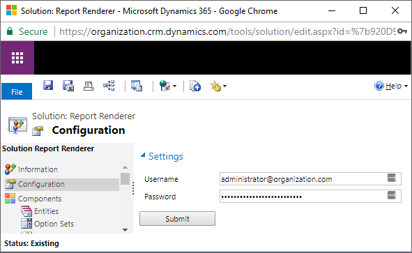
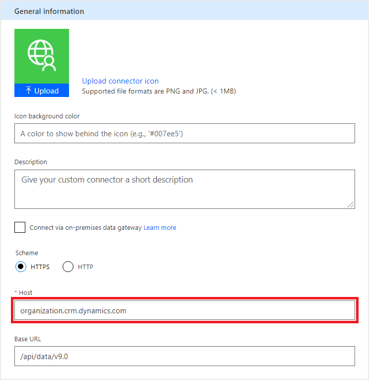
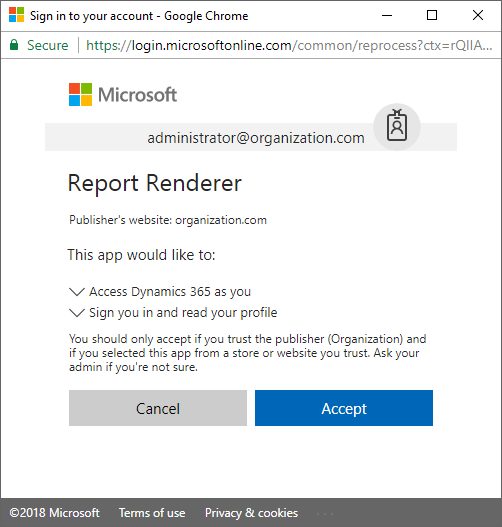

# Installation
First, download the files from the [Releases](../../../releases).

## Dynamics 365
1. Go to Settings > Solutions, click Import.
 
2. Follow the prompts to import the `ReportRenderer_X_X_X_X_managed.zip` file.

3. After the solution is imported, open it up.

4. Go to the Configuration page, set the username/password, and click Submit.

   

5. Open the `Render` process and activate it.

## Azure AD
1. Open Azure Active Directory blade from the [Azure Portal](https://portal.azure.com).

2. Open App registrations.

3. Click the link for "+ New Registration" to add a new application registration.  Give the registration any name, and set the Redirect URI to `https://global.consent.azure-apim.net/redirect`.

   

4. Copy the `Application (client) ID`.  You will use this as the Client ID in Power Automate.

5. Click on `Certificates & secrets` and add a `New client secret`. Give it any `Description` and click `Add`.  After saving, copy the generated value.  You will use this as the Client Secret in Power Automate.

   

6. Click on `API permissions` and `Add a permission`. Find `Dynamics CRM` in the list and add the `user_impersonation` permission.

   

## Power Automate
1. Click on the settings wheel at the top, and click `Custom Connectors`.  Under `+ New custom connector` click `Import an OpenAPI file`.

   
   

2. On the next screen, replace the `Host` with your Dynamics 365 host.

   

3. Next, configure Security.  Use the Client ID/Secret values you copied from the Azure AD app registration.  Also replace the Resource URL.

   

4. Click on the Test link, then click Create Connector.

5. Create a new connection.

   

6. After logging in, you will be asked to consent to the permissions.

   

7. Finally, test an API call.  
   _You may get a 404 error.  Wait approximately 30 minutes and try again._